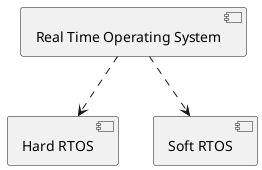

RTOS - Real Time Operating System is a software component mainly used in embedded systems as software to manage the various tasks and most importantly meet the deadlines.

@startuml
Bob -> Alice : hello
@enduml

# Types
Generally, RTOS is divided into two types, based on the need to meet the task deadlines.
1. Hard RTOS
2. Soft RTOS

``` plantuml
Bob -> Alice : hello world
```


Hard RTOS which may result in catastrophic event if deadline of the task is missed, while Soft RTOS may only slow the system in case the task deadline is missed.

